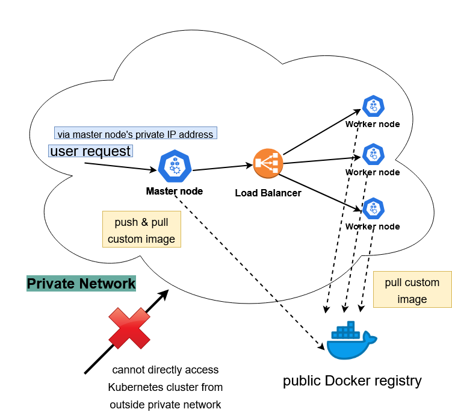

# SpeechLab - Speech Recognition System Local Deployment

## Description

This portion of the project is to test a local deployment of the Speech Lab Speech Recognition System. The local deployment would not make use of any public cloud resources e.g Azure to carry out its functions. 

## Changes Made

1. Speech recognition models are uploaded to each node 

Azure Files will be replaced with the workers mounting the models directly on the filesystem. This will also reduce the time taken to download the files from Azure Files. 

2. using `kubeadm` to create a local Kubernetes cluster

The local deployment will not use any cloud Kubernetes service e.g *Azure Kubernetes Service* that will work out of the box but instead manually run the commands to setup a Kubernetes cluster.

More information about setting up the cluster manually here - https://kubernetes.io/docs/setup/production-environment/tools/kubeadm/create-cluster-kubeadm/ 

3. Speech Recognition service **ONLY** accessible from within private network

The nginx sticky session which routes requests to the master service is only exposed to local network. You need to be within the **same network** as the nodes to access the service. That is to say, you cannot use a public IP address to access the Kubernetes cluster. A workaround would be to SSH into a host within the network to make requests to the Kubernetes cluster.

## Overarching System Architecture

## Deployment

### Set up a master node (master_node_setup.sh)

This is a semi automated script to set up the Kubernetes cluster as well as the master node. During the process of running the `master_node_setup.sh`, you will be prompted to key in certain information to facilitate the setup process. The script assumes the node has zero dependencies installed and will run the commands to install every dependencies required. 

As the `master_node_setup.sh` runs, you will be prompted for,

1. **Docker account login**

This is for the master node to build and upload the custom Docker image to the Docker Hub registry for the rest of the nodes to download.

2. **Username of the Docker Hub account used to upload the image**

This is to facilitate the upload of the custom Docker image to the Docker Hub.

### Steps

1. Put the speech recognition models in the `models/` directory in this folder. Refer to the README.md in that folder for more information.

2. Compress and zip up this directory e.g `sudo tar cvzf local-speechlab-deployment.tar.gz local_deployment/`

3. Transfer the tar file to the master node (you may physically transfer the compressed directory with a stick or via SSH i.e using `scp`)

4. Uncompress the tar file e.g `tar -xvf local-speechlab-deployment.tar.gz`

5. Change directory into the uncompressed folder i.e `local_deployment`

`cd speechlab-aims-kaldi-aks/local_deployment`

6. Make the setup script executable

`chmod +x master_node_setup.sh worker_node_setup.sh`

7. Run the script

`sudo ./master_node_setup.sh`

### Set up a worker node (worker_node_setup.sh)

This is a semi automated script to set up a worker node to join the Kubernetes cluster. During the process of running the `worker_node_setup.sh`, you will be prompted to key in certain information to facilitate the setup process. The script assumes the node has zero dependencies installed and will run the commands to install every dependencies required. 

As the `worker_node_setup.sh` runs, you will be prompted for,

1. **The master node's IP address**

This will facilitate the process of copying the Kubernetes cluster's config file over to the worker node for it to access the Kubernetes cluster's API server i.e. to run commands like `kubectl get pods`.

2. **The command to join the Kubernetes cluster**

After the Kubernetes cluster is created by the master node, a file i.e. `kube_details.txt` is created containing the information about the Kubernetes cluster including the command needed for a worker node to join the cluster. The script will run the command and help this worker node to join the cluster. 

The command would look something like this - `kubeadm join 172.16.0.5:6443 --token flk0z4.r11s0asq3v3bcno2 --discovery-token-ca-cert-hash sha256:aadf4c3170a30639e90b3b48732f7202747db842dc64c5292c48174388`.

3. **Username of the Docker Hub account which the custom Docker image is uploaded to**

As mentioned before, the `master_node_setup.sh` script will build and upload the image to the registry thus inputting the username of the Docker Hub acccount which the image is uploaded to, will allow the node to download the image successfully.

4. **Password to the master node's access**

In order for a worker node to access the Kubernetes cluster's API server i.e. run commands like `kubectl get pods`, the worker node needs the `config` file of the Kubernetes cluster. A command is ran to copy the file over to the worker node and the access to the master node is required to copy the file over.

### Steps

1. Put the speech recognition models in the `models/` directory in this folder. Refer to the README.md in that folder for more information.

2. Compress and zip up this directory e.g `sudo tar cvzf local-speechlab-deployment.tar.gz local_deployment/`

3. Transfer the tar file to the master node (you may physically transfer the compressed directory with a stick or via SSH i.e using `scp`)

4. Uncompress the tar file e.g `tar -xvf local-speechlab-deployment.tar.gz`

5. Change directory into the uncompressed folder i.e `local_deployment`

`cd speechlab-aims-kaldi-aks/local_deployment`

6. Make the setup script executable

`chmod +x master_node_setup.sh worker_node_setup.sh`

7. Run the script

`sudo ./worker_node_setup.sh`

## Usage

**Same as before.** Use the endpoint to the nginx sticky service to access the service. The endpoint should be the *master node's private IP address**. (if nothing of the deployment scripts is changed)

Example commands to run,

`curl  -X PUT -T docker/audio/episode-1-introduction-and-origins.wav --header "model: SingaporeCS_0519NNET3" --header "content-type: audio/x-wav" "http://172.16.0.6/client/dynamic/recognize"`

## Notes

### Private access only

Since the speech recognition system is deployed locally, this setup is also designed to be accessed from the **private network** only. In order to use the speech recognition functionalities, one would need to be in the same private network as the nodes to access the system. The endpoint to reach the system is fixed as the **private IP address of the master node** *e.g. 172.16.0.5*.

### Single master node

Currently, the setup only configures one master node. That is to say, if the master node is down, users would not be able to access the service at all. In order to create a multi-master nodes setup, the network would need to have a floating IP address (something like a public IP address that a load balancer can use) to assign to. *Need further details about how the networking is going to be like to set this up.* For now, the single master node setup will work as long as the master node is up and running.

### Monitoring System

The monitoring system although installed, is not available at the moment. Reason is the same as that of the single master node problem, where there is no floating IP address for the service to be reached. If we were to use any of the worker node's private IP address and that worker node is offline, the monitoring system would not be accessible.

## Common problems

### I cannot run kubectl commands on my worker node

`error: Error loading config file "/home/speechlablocal/.kube/config": open /home/speechlablocal/.kube/config: permission denied`

It might be a permissions issue. Run the following command on your worker node as admin,

`sudo chown -R $(id -u):$(id -g) $HOME/.kube/config`