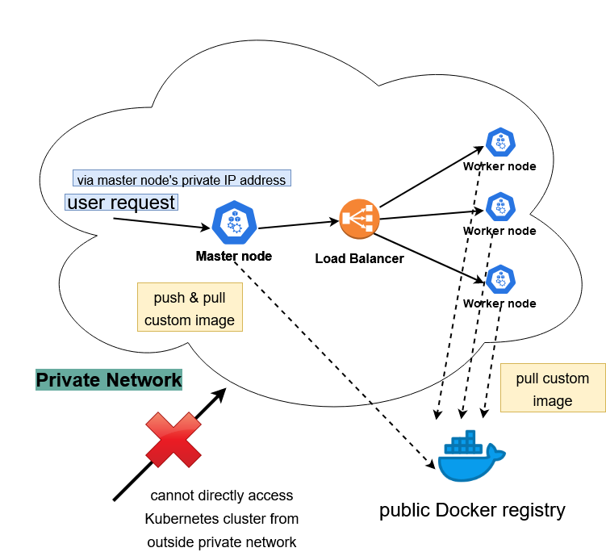

# SpeechLab - Speech Recognition System Local Deployment

## Description

This portion of the project is to test a local deployment of the Speech Lab Speech Recognition System. The local deployment would not make use of any public cloud resources e.g Azure to carry out its functions. 

## Changes Made

1. Speech recognition models are uploaded to each node 

Azure Files will be replaced with the workers mounting the models directly on the filesystem. This will also reduce the time taken to download the files from Azure Files. 

2. using `kubeadm` to create a local Kubernetes cluster

The local deployment will not use any cloud Kubernetes service e.g *Azure Kubernetes Service* that will work out of the box but instead manually run the commands to setup a Kubernetes cluster.

More information about setting up the cluster manually here - https://kubernetes.io/docs/setup/production-environment/tools/kubeadm/create-cluster-kubeadm/ 

3. Speech Recognition service **ONLY** accessible from within private network

The nginx sticky session which routes requests to the master service is only exposed to local network. You need to be within the **same network** as the nodes to access the service. That is to say, you cannot use a public IP address to access the Kubernetes cluster. A workaround would be to SSH into a host within the network to make requests to the Kubernetes cluster.

## Overarching System Architecture

## Usage

### Set up a master node

1. Put the speech recognition models in the `models/` directory in this folder. Refer to the README.md in that folder for more information.

2. Compress and zip up this directory e.g `sudo tar cvzf local-speechlab-deployment.tar.gz $HOME/speechlab-aims-kaldi-aks/local_deployment/`

3. Transfer the tar file to the master node (you may physically transfer the compressed directory with a stick or via SSH i.e using `scp`)

4. Uncompress the tar file e.g `tar -xvf local-speechlab-deployment.tar.gz`

5. Change directory into the uncompressed folder i.e `local_deployment`

`cd speechlab-aims-kaldi-aks/local_deployment`

6. Make the setup script executable

`chmod +x master_node_setup.sh worker_node_setup.sh`

7. Run the script

`sudo ./master_node_setup.sh`